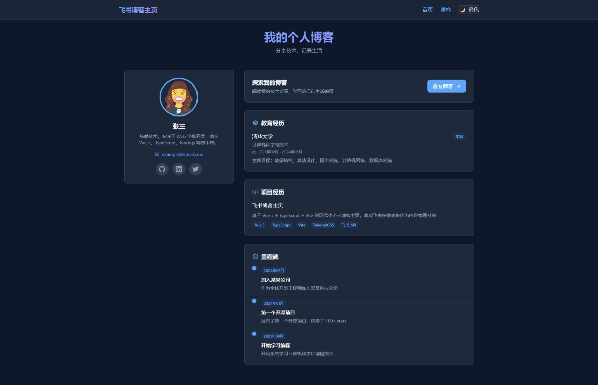
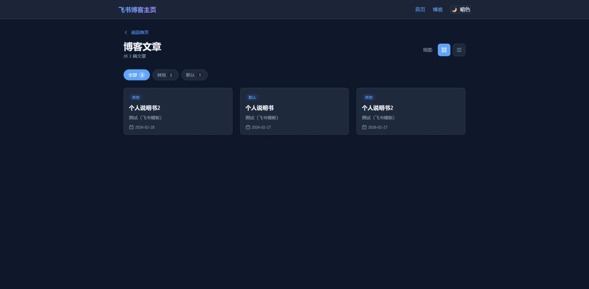

# Feishu Blog Homepage

[中文](README.md) | English

A modern personal blog homepage built with Vue 3 + TypeScript + Vite, integrated with Feishu Bitable as a content management system.

## ✨ Features

- 🚀 **Modern Tech Stack**: Vue 3 + TypeScript + Vite + TailwindCSS
- 📝 **Feishu Integration**: Manage blog content with Feishu Bitable
- 🎨 **Theme Switching**: Support light/dark themes with system preference detection
- 📱 **Responsive Design**: Perfect adaptation for desktop and mobile devices
- 🔍 **Category Filtering**: Browse blog posts by category
- 📊 **Multiple View Modes**: Switch between card view and timeline view
- ⚡ **Auto Deployment**: Automated build and deployment with GitHub Actions
- 🧪 **Complete Testing**: 167 unit tests ensure code quality

## 📸 Preview

### Desktop

<table>
  <tr>
    <td>
      <p align="center"><b>Homepage</b></p>
      
    </td>
  </tr>
  <tr>
    <td>
      <p align="center"><b>Blog List</b></p>
      
    </td>
  </tr>
</table>

### Mobile

<table>
  <tr>
    <td width="50%">
      <p align="center"><b>Homepage</b></p>
      
    </td>
    <td width="50%">
      <p align="center"><b>Blog List</b></p>
      
    </td>
  </tr>
</table>

## 🏗️ Tech Stack

### Frontend Technologies

| Technology | Version | Description |
|------------|---------|-------------|
| Vue 3 | ^3.4.21 | Progressive JavaScript Framework |
| TypeScript | ^5.4.2 | Typed superset of JavaScript |
| Vite | ^5.1.6 | Next generation frontend tooling |
| Vue Router | ^4.6.4 | Official router for Vue.js |
| TailwindCSS | ^4.2.1 | Utility-first CSS framework |
| Vitest | ^4.0.18 | Vite-native unit test framework |

### Project Structure

```
feishu-blog-homepage/
├── .github/
│   └── workflows/
│       ├── deploy.yml          # GitHub Actions deployment config
│       └── README.md           # Actions configuration guide
├── scripts/
│   ├── fetch-blogs.ts          # Feishu data fetching script
│   ├── fetch-blogs.test.ts     # Script tests
│   └── README.md               # Script usage guide
├── src/
│   ├── assets/
│   │   └── styles/
│   │       └── main.css        # Global styles and theme variables
│   ├── components/
│   │   ├── blog/               # Blog-related components
│   │   ├── common/             # Common components
│   │   └── home/               # Homepage components
│   ├── composables/            # Composition functions
│   ├── config/
│   │   └── site.config.ts      # Site configuration
│   ├── data/
│   │   └── blogs.json          # Blog data (auto-generated)
│   ├── router/
│   │   └── index.ts            # Router configuration
│   ├── types/
│   │   └── index.ts            # TypeScript type definitions
│   ├── utils/
│   │   └── validateConfig.ts  # Configuration validation
│   ├── views/                  # Page views
│   ├── App.vue                 # Root component
│   └── main.ts                 # Application entry
├── .env.example                # Environment variables example
├── DEPLOYMENT.md               # Deployment guide
├── package.json                # Project dependencies
└── README.md                   # Project documentation
```

### Core Modules

#### 1. Blog Data Management (`useBlogData`)
- Fetch blog data from Feishu Bitable
- Static data fallback support
- Automatic category aggregation
- Filter by category
- Sort by time

#### 2. Theme Management (`useTheme`)
- Light/dark theme switching
- Auto-follow system preference
- localStorage persistence
- Smooth transition animations

#### 3. Routing
- Homepage: Personal information display
- Blog List: Multi-view and filtering support
- Blog Detail: Embedded Feishu document via iframe
- 404 Page: Friendly error message

## 🚀 Quick Start

### Prerequisites

- Node.js >= 18
- npm >= 9
- Feishu Open Platform account (for content management)

### Installation

1. **Clone the repository**
   ```bash
   git clone https://github.com/your-username/feishu-blog-homepage.git
   cd feishu-blog-homepage
   ```

2. **Install dependencies**
   ```bash
   npm install
   ```

3. **Configure environment variables**
   ```bash
   cp .env.example .env
   ```
   
   Edit `.env` file with your Feishu app credentials:
   ```env
   FEISHU_APP_ID=cli_xxxxxxxxxxxxxxxx
   FEISHU_APP_SECRET=xxxxxxxxxxxxxxxxxxxxxxxxxxxxxxxx
   FEISHU_TABLE_ID=bascnxxxxxxxxxxxxxx/tblxxxxxxxxxxxxxx
   ```

4. **Fetch blog data**
   ```bash
   npm run fetch-blogs
   ```

5. **Start development server**
   ```bash
   npm run dev
   ```
   
   Visit http://localhost:3000 to view the site

### Available Commands

```bash
# Development
npm run dev              # Start development server

# Build
npm run build            # Build for production
npm run build:prod       # Fetch latest data and build
npm run preview          # Preview production build

# Testing
npm run test             # Run all tests
npm run test:watch       # Run tests in watch mode
npm run test:coverage    # Generate coverage report

# Data Management
npm run fetch-blogs      # Fetch latest blog data from Feishu
```

## 📝 Content Management

### Feishu Bitable Configuration

1. **Create Feishu App**
   - Visit [Feishu Open Platform](https://open.feishu.cn/)
   - Create an enterprise self-built app
   - Get App ID and App Secret
   - Add permissions: `bitable:app` and `bitable:app:readonly`

2. **Create Bitable**
   
   Create a bitable in Feishu with the following fields:

   | Field Name | Type | Required | Description |
   |------------|------|----------|-------------|
   | Title | Text | ✅ | Blog title |
   | Summary | Text | ❌ | Blog summary |
   | Category | Single Select | ❌ | Blog category |
   | Published Date | Date | ❌ | Publication date |
   | Document Link | URL | ✅ | Feishu document link |
   | Cover Image | URL | ❌ | Cover image link |

3. **Get Table ID**
   
   Extract from bitable URL:
   ```
   https://xxx.feishu.cn/base/bascnxxxxxxxxxxxxxx?table=tblxxxxxxxxxxxxxx
   ```
   
   Combined format: `bascnxxxxxxxxxxxxxx/tblxxxxxxxxxxxxxx`

4. **Update Blog Content**
   
   - Add or modify records in Feishu Bitable
   - Run `npm run fetch-blogs` to get latest data
   - Or push code to GitHub for automatic update

For detailed instructions, see [scripts/README.md](scripts/README.md)

## 🌐 Deployment

### Deploy to GitHub Pages

1. **Push code to GitHub**
   ```bash
   git init
   git add .
   git commit -m "Initial commit"
   git branch -M main
   git remote add origin https://github.com/your-username/your-repo.git
   git push -u origin main
   ```

2. **Configure GitHub Secrets**
   
   Add in repository Settings > Secrets and variables > Actions:
   - `FEISHU_APP_ID`
   - `FEISHU_APP_SECRET`
   - `FEISHU_TABLE_ID`

3. **Enable GitHub Pages**
   
   In repository Settings > Pages:
   - Set Source to "GitHub Actions"

4. **Auto Deployment**
   
   Every push to `main` branch triggers GitHub Actions to:
   - Run tests
   - Fetch latest data from Feishu
   - Build project
   - Deploy to GitHub Pages

For detailed instructions, see [DEPLOYMENT.md](DEPLOYMENT.md)

### Other Platforms

The project can be deployed to any static hosting platform:

- **Vercel**: Import GitHub repository
- **Netlify**: Connect GitHub repository, build command `npm run build`
- **Cloudflare Pages**: Connect GitHub, build command `npm run build`

## 🎨 Customization

### Site Configuration

Edit `src/config/site.config.ts` to modify site information:

```typescript
export const siteConfig: SiteConfig = {
  // Basic information
  title: 'Your Name',
  description: 'Your Bio',
  
  // Profile
  profile: {
    name: 'Your Name',
    avatar: 'Avatar URL',
    bio: 'Personal bio',
    // ...
  },
  
  // Social links
  social: {
    github: 'https://github.com/your-username',
    // ...
  }
}
```

### Theme Styles

Edit `src/assets/styles/main.css` to modify theme colors:

```css
:root {
  --color-primary: #3b82f6;      /* Primary color */
  --color-background: #ffffff;    /* Background color */
  --color-text-primary: #1f2937; /* Primary text color */
  /* ... */
}
```

### Routing

Edit `src/router/index.ts` to add or modify routes.

## 🧪 Testing

The project includes comprehensive unit tests:

```bash
# Run all tests
npm run test

# Watch mode
npm run test:watch

# Generate coverage report
npm run test:coverage
```

Test Coverage:
- ✅ Component tests (60 tests)
- ✅ Composables tests (51 tests)
- ✅ Utility function tests (38 tests)
- ✅ Data fetching script tests (12 tests)
- ✅ Router tests

## 📚 Documentation

- [Deployment Guide](DEPLOYMENT.md) - Detailed deployment steps and troubleshooting
- [GitHub Actions Config](.github/workflows/README.md) - CI/CD configuration guide
- [Data Fetching Scripts](scripts/README.md) - Feishu API usage guide

## 🤝 Contributing

Issues and Pull Requests are welcome!

## 📄 License

MIT License

## 🙏 Acknowledgments

- [Vue.js](https://vuejs.org/) - Progressive JavaScript Framework
- [Vite](https://vitejs.dev/) - Next Generation Frontend Tooling
- [TailwindCSS](https://tailwindcss.com/) - Utility-first CSS Framework
- [Feishu Open Platform](https://open.feishu.cn/) - Content management capabilities

## 📞 Contact

For questions or suggestions:

- GitHub Issues: [Submit Issue](https://github.com/your-username/feishu-blog-homepage/issues)
- Email: your.email@example.com

---

⭐ If this project helps you, please give it a star!
